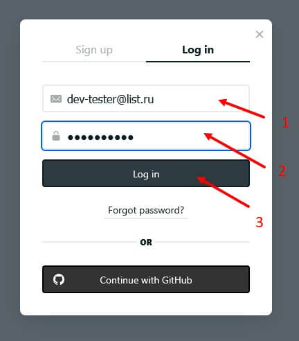
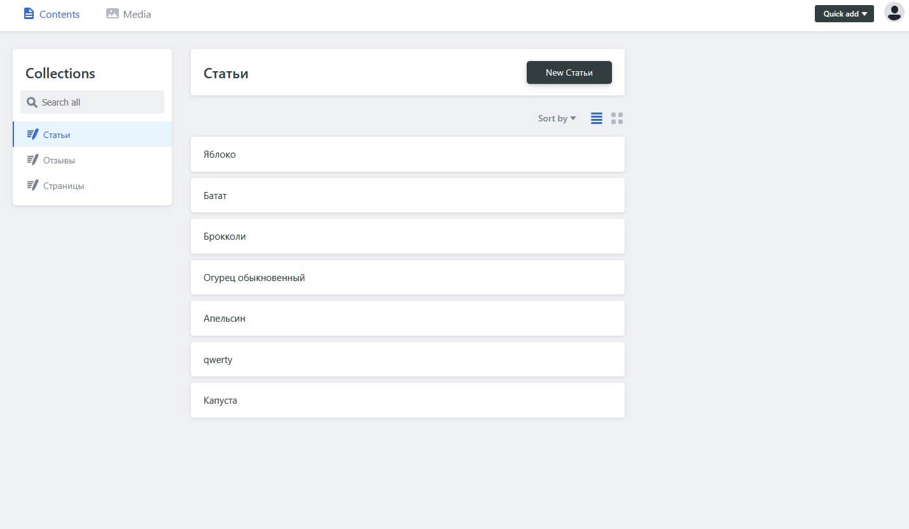

# Авторизация в CMS

Для управления контентом используемся CMS Decap.

Чтобы открыть админ-панель CMS Decap нужно добавить `/admin/` в конец адресной строки. Или просто пройти по [ссылке](https://perx-hugo-test-case.netlify.app/admin/)

Админка доступна по адресу:

```
https://perx-hugo-test-case.netlify.app/admin/
```


Доступ в админку предоставляется через систему Netlify Identity по инвайту на почту. После чего нужно подтвердить почту пройдя по ссылке. И ввести желаемый пароль для дальнейшего использования.

Для демонстрации работоспособности проекта создан временный аккаунт.

Вводим логин и пароль.

* mail: dev-tester@list.ru
* password: 123test321



При успешном входе увидим CMS

